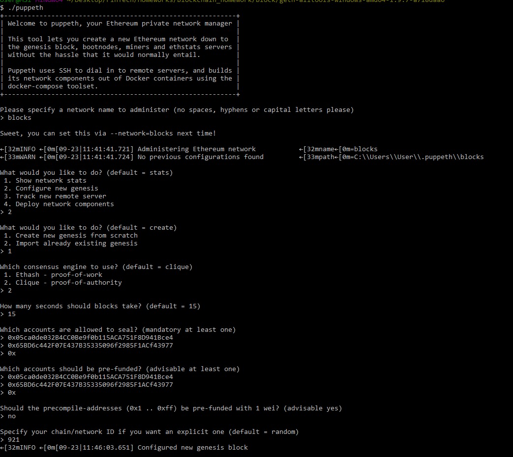
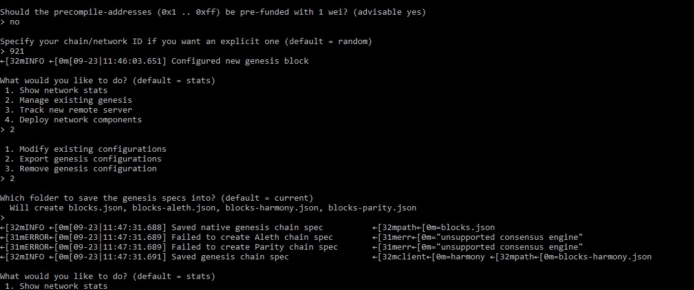
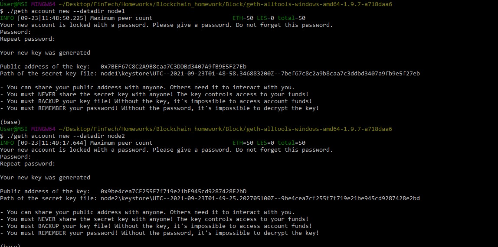
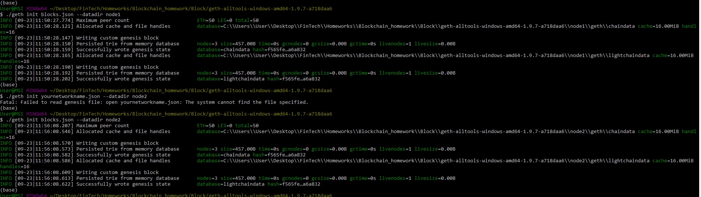
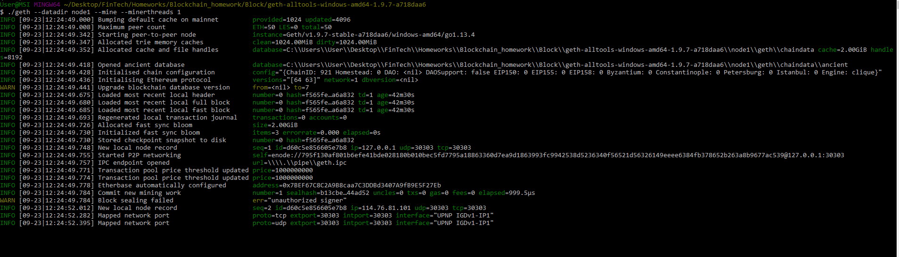
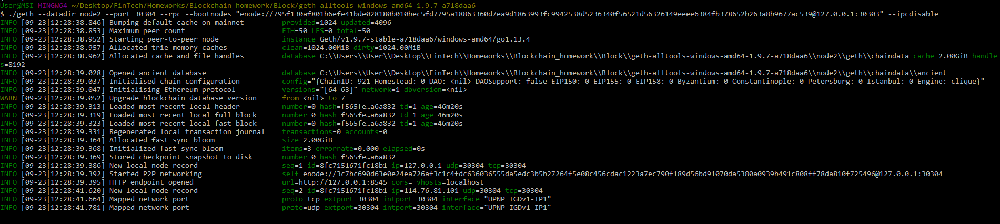
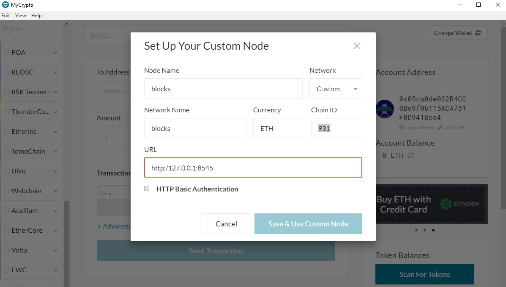
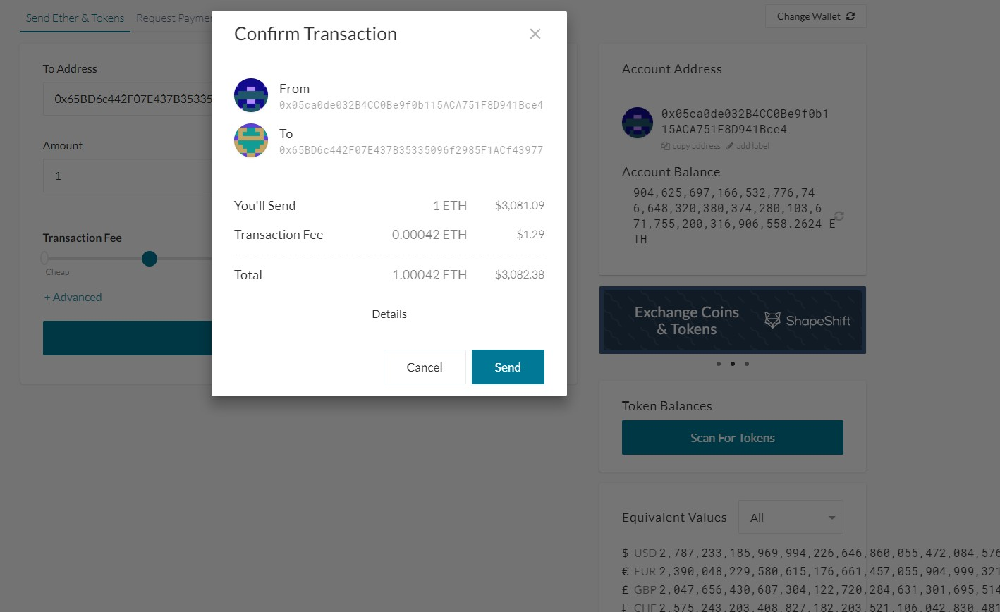
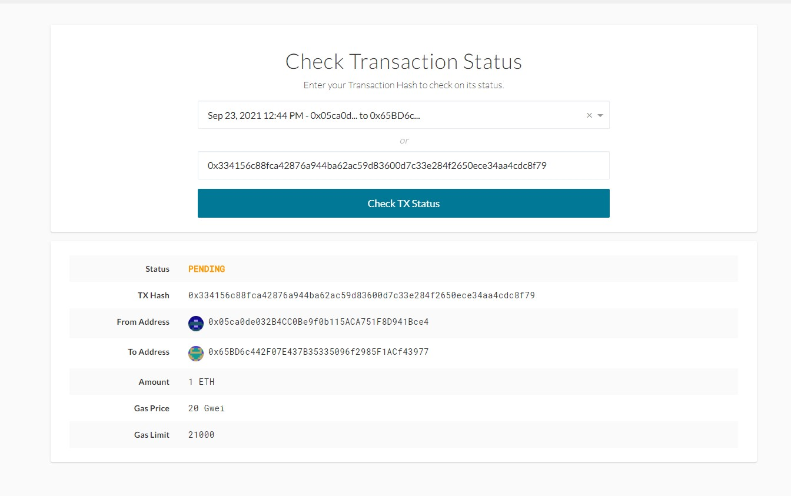

# Proof of Authority Development Chain

The Proof of Authority (PoA) algorithm is typically used for private blockchain networks as it requires pre-approval of, or voting in of, the account addresses that can approve transactions (seal blocks)

## Generating Genesis blockchain and Proof of Authority

* To generate genesis block, first run puppeth

 ./puppeth

Network name: blocks

Blocktime: 15 (Default 15)

## Setting update Network and ' json files

Network ID: 921

Exit puppeth by using the Ctrl+C keys combination.

## Creating Nodes

1- Generate two new nodes with new account addresses that will serve as our pre-approved sealer addresses

./geth --datadir node1 account new

./geth --datadir node2 account new

2- Save passwords & Account addresses for use later

Node 1: Public address of the key: 7BEF67C8C2A9B8caa7C3DDBd3407A9fB9E5F27Eb
Node 2: Public address of the key: 65BD6c442F07E437B35335096f2985F1ACf43977

* echo 'node1' > node1/password.txt
* echo 'node2' > node2/password.txt
* echo 'd1807e1e199ACB62d097ce19b62F0b4664c129F0' >> accounts.txt
* echo '49D4Cd480100E2D3bfa1D6f55cB493E799Aee339' >> accounts.txt

* Exit puppeth by using the Ctrl+C keys combination.

3 - Initialize the nodes with the genesis' json file

./geth init block.json --datadir node1

./geth init block.json --datadir node2

## Start Mining Mode

Open new terminal

./geth --datadir node1 --mine --minerthreads 1

Open second terminal 

./geth --datadir node2 --port 30304 --rpc --bootnodes "enode://795f130af801b6efe41bde028180b010bec5fd7795a18863360d7ea9d1863993fc9942538d5236340f56521d56326149eeee6384fb378652b263a8b9677ac539@127.0.0.1:30303" --ipcdisable

# MyCrypto

1- Open the MyCrypto app, then click Change Network at the bottom left. Click "Add Custom Node", then add the custom network information that you set in the genesis. Scroll down to choose Custom in the "Network" column to reveal more options like Chain ID.

2- Import the keystore file from the directory into MyCrypto.

3- Sending money between accounts

4- Copy the hash and paste it into the "TX Status" section of the app, or click "TX Status".

